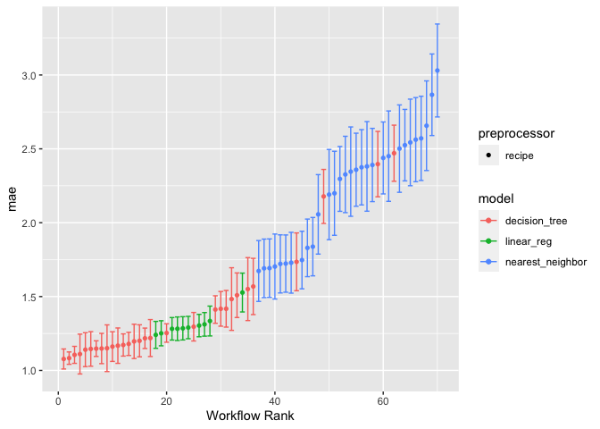
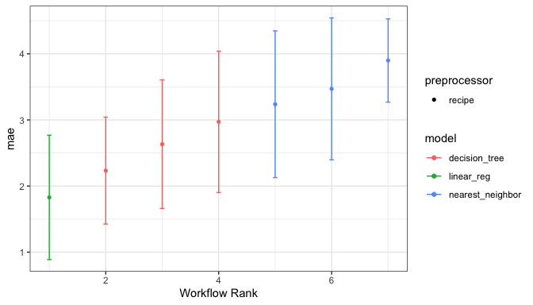

<!-- README.md is generated from README.Rmd. Please edit that file -->

# workflowsets

<!-- badges: start -->

[](https://github.com/tidymodels/workflowsets/actions/workflows/R-CMD-check.yaml)
[](https://github.com/tidymodels/workflowsets/actions/workflows/R-CMD-check-no-suggests.yaml)
[](https://app.codecov.io/gh/tidymodels/workflowsets?branch=main)
[](https://lifecycle.r-lib.org/articles/stages.html)
<!-- badges: end -->

The goal of workflowsets is to allow users to create and easily fit a
large number of models. workflowsets can create a *workflow set* that
holds multiple workflow objects. These objects can be created by
crossing all combinations of preprocessors (e.g., formula, recipe, etc)
and model specifications. This set can be tuned or resampled using a set
of specific functions.

## Installation

You can install the released version of workflowsets from
[CRAN](https://CRAN.R-project.org) with:

``` r
install.packages("workflowsets")
```

And the development version from [GitHub](https://github.com/) with:

``` r
install.packages("pak")
pak::pak("tidymodels/workflowsets")
```

## Example

Sometimes it is a good idea to try different types of models and
preprocessing methods on a specific data set. The tidymodels framework
provides tools for this purpose:
[recipes](https://recipes.tidymodels.org/) for preprocessing/feature
engineering and [parsnip model](https://parsnip.tidymodels.org/)
specifications. The workflowsets package has functions for creating and
evaluating combinations of these modeling elements.

For example, the Chicago train ridership data has many numeric
predictors that are highly correlated. There are a few approaches to
compensating for this issue during modeling:

1.  Use a feature filter to remove redundant predictors.

2.  Apply principal component analysis to decorrelate the data.

3.  Use a regularized model to make the estimation process insensitive
    to correlated predictors.

The first two methods can be used with any model while the last option
is only available for specific models. Let’s create a basic recipe that
we will build on:

``` r
library(tidymodels)
data(Chicago)
# Use a small sample to keep file sizes down:
Chicago <- Chicago |> slice(1:365)

base_recipe <-
  recipe(ridership ~ ., data = Chicago) |>
  # create date features
  step_date(date) |>
  step_holiday(date) |>
  # remove date from the list of predictors
  update_role(date, new_role = "id") |>
  # create dummy variables from factor columns
  step_dummy(all_nominal()) |>
  # remove any columns with a single unique value
  step_zv(all_predictors()) |>
  step_normalize(all_predictors())
```

To enact a correlation filter, an additional step is used:

``` r
filter_rec <-
  base_recipe |>
  step_corr(all_of(stations), threshold = tune())
```

Similarly, for PCA:

``` r
pca_rec <-
  base_recipe |>
  step_pca(all_of(stations), num_comp = tune()) |>
  step_normalize(all_predictors())
```

We might want to assess a few different models, including a regularized
method (`glmnet`):

``` r
regularized_spec <-
  linear_reg(penalty = tune(), mixture = tune()) |>
  set_engine("glmnet")

cart_spec <-
  decision_tree(cost_complexity = tune(), min_n = tune()) |>
  set_engine("rpart") |>
  set_mode("regression")

knn_spec <-
  nearest_neighbor(neighbors = tune(), weight_func = tune()) |>
  set_engine("kknn") |>
  set_mode("regression")
```

Rather than creating all 9 combinations of these preprocessors and
models, we can create a *workflow set*:

``` r
chi_models <-
  workflow_set(
    preproc = list(
      simple = base_recipe, filter = filter_rec,
      pca = pca_rec
    ),
    models = list(
      glmnet = regularized_spec, cart = cart_spec,
      knn = knn_spec
    ),
    cross = TRUE
  )
chi_models
#> # A workflow set/tibble: 9 × 4
#>   wflow_id      info             option    result    
#>   <chr>         <list>           <list>    <list>    
#> 1 simple_glmnet <tibble [1 × 4]> <opts[0]> <list [0]>
#> 2 simple_cart   <tibble [1 × 4]> <opts[0]> <list [0]>
#> 3 simple_knn    <tibble [1 × 4]> <opts[0]> <list [0]>
#> 4 filter_glmnet <tibble [1 × 4]> <opts[0]> <list [0]>
#> 5 filter_cart   <tibble [1 × 4]> <opts[0]> <list [0]>
#> 6 filter_knn    <tibble [1 × 4]> <opts[0]> <list [0]>
#> 7 pca_glmnet    <tibble [1 × 4]> <opts[0]> <list [0]>
#> 8 pca_cart      <tibble [1 × 4]> <opts[0]> <list [0]>
#> 9 pca_knn       <tibble [1 × 4]> <opts[0]> <list [0]>
```

It doesn’t make sense to use PCA or a filter with a `glmnet` model. We
can remove these easily:

``` r
chi_models <-
  chi_models |>
  anti_join(tibble(wflow_id = c("pca_glmnet", "filter_glmnet")),
    by = "wflow_id"
  )
```

These models all have tuning parameters. To resolve these, we’ll need a
resampling set. In this case, a time-series resampling method is used:

``` r
splits <-
  sliding_period(
    Chicago,
    date,
    "day",
    lookback = 300, # Each resample has 300 days for modeling
    assess_stop = 7, # One week for performance assessment
    step = 7 # Ensure non-overlapping weeks for assessment
  )
splits
#> # Sliding period resampling 
#> # A tibble: 9 × 2
#>   splits          id    
#>   <list>          <chr> 
#> 1 <split [301/7]> Slice1
#> 2 <split [301/7]> Slice2
#> 3 <split [301/7]> Slice3
#> 4 <split [301/7]> Slice4
#> 5 <split [301/7]> Slice5
#> 6 <split [301/7]> Slice6
#> 7 <split [301/7]> Slice7
#> 8 <split [301/7]> Slice8
#> 9 <split [301/7]> Slice9
```

We’ll use simple grid search for these models by running
`workflow_map()`. This will execute a resampling or tuning function over
the workflows in the `workflow` column:

``` r
set.seed(123)
chi_models <-
  chi_models |>
  # The first argument is a function name from the {{tune}} package
  # such as `tune_grid()`, `fit_resamples()`, etc.
  workflow_map("tune_grid",
    resamples = splits, grid = 10,
    metrics = metric_set(mae), verbose = TRUE
  )
#> i 1 of 7 tuning:     simple_glmnet
#> ✔ 1 of 7 tuning:     simple_glmnet (2s)
#> i 2 of 7 tuning:     simple_cart
#> ✔ 2 of 7 tuning:     simple_cart (2.8s)
#> i 3 of 7 tuning:     simple_knn
#> ✔ 3 of 7 tuning:     simple_knn (2.3s)
#> Warning: Using `all_of()` outside of a selecting function was deprecated in tidyselect
#> 1.2.0.
#> ℹ See details at
#>   <https://tidyselect.r-lib.org/reference/faq-selection-context.html>
#> This warning is displayed once every 8 hours.
#> Call `lifecycle::last_lifecycle_warnings()` to see where this warning was
#> generated.
#> i 4 of 7 tuning:     filter_cart
#> ✔ 4 of 7 tuning:     filter_cart (5.4s)
#> i 5 of 7 tuning:     filter_knn
#> ✔ 5 of 7 tuning:     filter_knn (5.3s)
#> i 6 of 7 tuning:     pca_cart
#> ✔ 6 of 7 tuning:     pca_cart (4s)
#> i 7 of 7 tuning:     pca_knn
#> ✔ 7 of 7 tuning:     pca_knn (3.6s)
chi_models
#> # A workflow set/tibble: 7 × 4
#>   wflow_id      info             option    result   
#>   <chr>         <list>           <list>    <list>   
#> 1 simple_glmnet <tibble [1 × 4]> <opts[3]> <tune[+]>
#> 2 simple_cart   <tibble [1 × 4]> <opts[3]> <tune[+]>
#> 3 simple_knn    <tibble [1 × 4]> <opts[3]> <tune[+]>
#> 4 filter_cart   <tibble [1 × 4]> <opts[3]> <tune[+]>
#> 5 filter_knn    <tibble [1 × 4]> <opts[3]> <tune[+]>
#> 6 pca_cart      <tibble [1 × 4]> <opts[3]> <tune[+]>
#> 7 pca_knn       <tibble [1 × 4]> <opts[3]> <tune[+]>
```

The `results` column contains the results of each call to `tune_grid()`
for the workflows.

The `autoplot()` method shows the rankings of the workflows:

``` r
autoplot(chi_models)
```



or the best from each workflow:

``` r
autoplot(chi_models, select_best = TRUE)
```



We can determine how well each combination did by looking at the best
results per workflow:

``` r
rank_results(chi_models, rank_metric = "mae", select_best = TRUE) |>
  select(rank, mean, model, wflow_id, .config)
#> # A tibble: 7 × 5
#>    rank  mean model            wflow_id      .config              
#>   <int> <dbl> <chr>            <chr>         <chr>                
#> 1     1  1.83 linear_reg       simple_glmnet Preprocessor1_Model10
#> 2     2  2.23 decision_tree    simple_cart   Preprocessor1_Model06
#> 3     3  2.63 decision_tree    filter_cart   Preprocessor06_Model1
#> 4     4  2.97 decision_tree    pca_cart      Preprocessor4_Model2 
#> 5     5  3.24 nearest_neighbor simple_knn    Preprocessor1_Model02
#> 6     6  3.47 nearest_neighbor filter_knn    Preprocessor06_Model1
#> 7     7  3.90 nearest_neighbor pca_knn       Preprocessor2_Model2
```

## Contributing

This project is released with a [Contributor Code of
Conduct](https://contributor-covenant.org/version/2/1/CODE_OF_CONDUCT.html).
By contributing to this project, you agree to abide by its terms.

- For questions and discussions about tidymodels packages, modeling, and
  machine learning, please [post on Posit
  Community](https://forum.posit.co/new-topic?category_id=15&tags=tidymodels,question).

- If you think you have encountered a bug, please [submit an
  issue](https://github.com/tidymodels/workflowsets/issues).

- Either way, learn how to create and share a
  [reprex](https://reprex.tidyverse.org/articles/articles/learn-reprex.html)
  (a minimal, reproducible example), to clearly communicate about your
  code.

- Check out further details on [contributing guidelines for tidymodels
  packages](https://www.tidymodels.org/contribute/) and [how to get
  help](https://www.tidymodels.org/help/).
