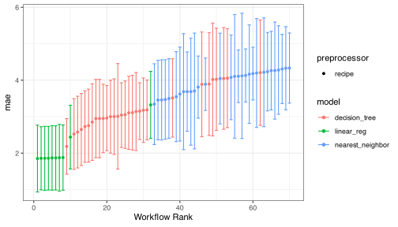

<!-- README.md is generated from README.Rmd. Please edit that file -->

# tbd

<!-- badges: start -->

<!-- badges: end -->

The goal of tbd is to allow users to create and easily fit a large
number of models. tbd can create a *workflow set* that holds multiple
workflow objects. These objects can be created by crossing all
combinations of preprocessors (e.g., formula, recipe, etc) and model
specifications. This set can be easier tuned or resampled using a set of
simple commands.

## Installation

You can install the released version of tbd from
[CRAN](https://CRAN.R-project.org) with:

``` r
# not yet!
# install.packages("tbd")
```

And the development version from [GitHub](https://github.com/) with:

``` r
# install.packages("devtools")
devtools::install_github("topepo/tbd")
```

## Example

It is often a good idea to try different types of models and
preprocessing methods on a specific data set. tidymodels provides tools
for this purpose: recipes for preprocessing/feature engineering and
model specifications.

Once a few options are available, it might be helpful to evaluate a
large combination of these techniques. tbd has functions for creating
and evaluating combinations of modeling elements.

For example, the Chicago train ridership data has many numeric
predictors that are highly correlated. There are a few approaches to
compensating for this issue during modeling:

1.  Use a feature filter to remove redundant predictors.

2.  Apply principal component analysis to decorrelate the data.

3.  Use a regularized model to make the estimation process insensitive
    to correlated predictors.

The first two methods can be used with any model while the last option
is only available for specific models. Let’s create a basic recipe that
we will build on:

``` r
library(tidymodels)
data(Chicago)

base_recipe <- 
   recipe(ridership ~ ., data = Chicago) %>% 
   # create date features
   step_date(date) %>% 
   step_holiday(date) %>% 
   # remove date form the list of predictors
   update_role(date, new_role = "id") %>% 
   # create dummy variables from factor columns
   step_dummy(all_nominal()) %>% 
   # remove any columns with a single unique value
   step_zv(all_predictors()) %>% 
   step_normalize(all_predictors())
```

To enact a correlation filter, an additional step is used:

``` r
filter_rec <- 
   base_recipe %>% 
   step_corr(all_of(stations), threshold = tune())
```

Similarly, for PCA:

``` r
pca_rec <- 
   base_recipe %>% 
   step_pca(all_of(stations), num_comp = tune()) %>% 
   step_normalize(all_predictors())
```

We might want to assess a few different models, including a regularized
method (`glmnet`):

``` r
regularized_spec <- 
   linear_reg(penalty = tune(), mixture = tune()) %>% 
   set_engine("glmnet")

cart_spec <- 
   decision_tree(cost_complexity = tune(), min_n = tune()) %>% 
   set_engine("rpart") %>% 
   set_mode("regression")

knn_spec <- 
   nearest_neighbor(neighbors = tune(), weight_func = tune()) %>% 
   set_engine("kknn") %>% 
   set_mode("regression")
```

Rather than creating all 9 combinations of these preprocessors and
models, we can create a *workflow set*:

``` r
library(tbd)
chi_models <- 
   workflow_set(
      preproc = list(simple = base_recipe, filter = filter_rec, pca = pca_rec),
      models = list(glmnet = regularized_spec, cart = cart_spec, knn = knn_spec),
      cross = TRUE
   )
chi_models
#> # A tibble: 9 x 6
#>   wflow_id      preproc model            object     option     result    
#>   <chr>         <chr>   <chr>            <list>     <list>     <list>    
#> 1 simple_glmnet recipe  linear_reg       <workflow> <list [0]> <list [0]>
#> 2 simple_cart   recipe  decision_tree    <workflow> <list [0]> <list [0]>
#> 3 simple_knn    recipe  nearest_neighbor <workflow> <list [0]> <list [0]>
#> 4 filter_glmnet recipe  linear_reg       <workflow> <list [0]> <list [0]>
#> 5 filter_cart   recipe  decision_tree    <workflow> <list [0]> <list [0]>
#> 6 filter_knn    recipe  nearest_neighbor <workflow> <list [0]> <list [0]>
#> 7 pca_glmnet    recipe  linear_reg       <workflow> <list [0]> <list [0]>
#> 8 pca_cart      recipe  decision_tree    <workflow> <list [0]> <list [0]>
#> 9 pca_knn       recipe  nearest_neighbor <workflow> <list [0]> <list [0]>
```

It doesn’t make sense to use PCA or a filter with a `glmnet` model. We
can remove these easily:

``` r
chi_models <- 
   chi_models %>% 
   anti_join(tibble(wflow_id = c("pca_glmnet", "filter_glmnet")), by = "wflow_id")
```

These models all have tuning parameters. To resolve these, we’ll need a
resampling set. In this case, a time-series resampling method is used:

``` r
splits <- 
   sliding_period(
      Chicago,
      date,
      "month",
      lookback = 15 * 12, # each resample has 15 years of data for modeling
      assess_stop = 1     # one month for performance assessment
   )
splits
#> # Sliding period resampling 
#> # A tibble: 7 x 2
#>   splits            id    
#>   <list>            <chr> 
#> 1 <split [5.5K/29]> Slice1
#> 2 <split [5.5K/31]> Slice2
#> 3 <split [5.5K/30]> Slice3
#> 4 <split [5.5K/31]> Slice4
#> 5 <split [5.5K/30]> Slice5
#> 6 <split [5.5K/31]> Slice6
#> 7 <split [5.5K/28]> Slice7
```

We’ll use simple grid search for these models by running
`workflow_map()`. This will execute a resampling or tuning function over
the workflows in the `object` column:

``` r
set.seed(123)
chi_models <- 
   chi_models %>% 
   workflow_map("tune_grid", resamples = splits, grid = 10, 
                metrics = metric_set(mae), verbose = TRUE)
#> ✓ 1 of 7 tuning:     simple_glmnet
#> ✓ 2 of 7 tuning:     simple_cart
#> ✓ 3 of 7 tuning:     simple_knn
#> ✓ 4 of 7 tuning:     filter_cart
#> ✓ 5 of 7 tuning:     filter_knn
#> ✓ 6 of 7 tuning:     pca_cart
#> ✓ 7 of 7 tuning:     pca_knn
chi_models
#> # A tibble: 7 x 6
#>   wflow_id      preproc model           object     option         result        
#>   <chr>         <chr>   <chr>           <list>     <list>         <list>        
#> 1 simple_glmnet recipe  linear_reg      <workflow> <named list [… <tibble [7 × …
#> 2 simple_cart   recipe  decision_tree   <workflow> <named list [… <tibble [7 × …
#> 3 simple_knn    recipe  nearest_neighb… <workflow> <named list [… <tibble [7 × …
#> 4 filter_cart   recipe  decision_tree   <workflow> <named list [… <tibble [7 × …
#> 5 filter_knn    recipe  nearest_neighb… <workflow> <named list [… <tibble [7 × …
#> 6 pca_cart      recipe  decision_tree   <workflow> <named list [… <tibble [7 × …
#> 7 pca_knn       recipe  nearest_neighb… <workflow> <named list [… <tibble [7 × …
```

The `results` column contains the results of each call to `tune_grid()`
for the workflows.

The `autoplot()` method shows the rankings of the workflows:

``` r
autoplot(chi_models)
```



We can determine how well each combination did by looking at the best
results per workflow:

``` r
best_by_wflow <-
   chi_models %>% 
   collect_metrics() %>%
   dplyr::select(wflow_id, .config, mean, n, std_err) %>% 
   group_by(wflow_id) %>%
   arrange(mean, .by_group = TRUE) %>%
   slice(1) %>%
   ungroup() %>%
   arrange(mean)
best_by_wflow
#> # A tibble: 7 x 5
#>   wflow_id      .config                mean     n std_err
#>   <chr>         <chr>                 <dbl> <int>   <dbl>
#> 1 simple_cart   Preprocessor1_Model04  1.07     7  0.0704
#> 2 pca_cart      Preprocessor3_Model2   1.12     7  0.107 
#> 3 filter_cart   Preprocessor02_Model1  1.15     7  0.117 
#> 4 simple_glmnet Preprocessor1_Model09  1.24     7  0.0916
#> 5 simple_knn    Preprocessor1_Model07  1.66     7  0.195 
#> 6 filter_knn    Preprocessor07_Model1  1.76     7  0.195 
#> 7 pca_knn       Preprocessor1_Model2   2.19     7  0.273
```
