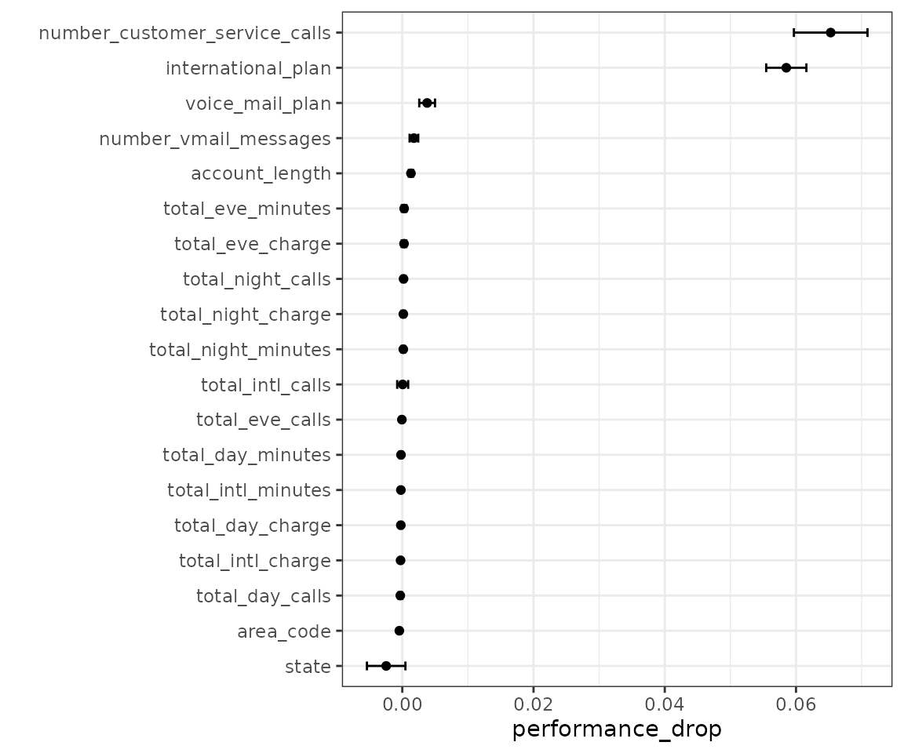

# Evaluating different predictor sets

Workflow sets are collections of tidymodels workflow objects that are
created as a set. A workflow object is a combination of a preprocessor
(e.g. a formula or recipe) and a `parsnip` model specification.

For some problems, users might want to try different combinations of
preprocessing options, models, and/or predictor sets. In stead of
creating a large number of individual objects, a cohort of workflows can
be created simultaneously.

In this example, we’ll fit the same model but specify different
predictor sets in the preprocessor list.

Let’s take a look at the customer churn data from the `modeldata`
package:

``` r
data(mlc_churn, package = "modeldata")
ncol(mlc_churn)
#> [1] 20
```

There are 19 predictors, mostly numeric. This include aspects of their
account, such as `number_customer_service_calls`. The outcome is a
factor with two levels: “yes” and “no”.

We’ll use a logistic regression to model the data. Since the data set is
not small, we’ll use basic 10-fold cross-validation to get resampled
performance estimates.

``` r
library(workflowsets)
library(parsnip)
library(rsample)
library(dplyr)
library(ggplot2)

lr_model <- logistic_reg() |> set_engine("glm")

set.seed(1)
trn_tst_split <- initial_split(mlc_churn, strata = churn)

# Resample the training set
set.seed(1)
folds <- vfold_cv(training(trn_tst_split), strata = churn)
```

We would make a basic workflow that uses this model specification and a
basic formula. However, in this application, we’d like to know which
predictors are associated with the best area under the ROC curve.

``` r
formulas <- leave_var_out_formulas(churn ~ ., data = mlc_churn)
length(formulas)
#> [1] 20

formulas[["area_code"]]
#> churn ~ state + account_length + international_plan + voice_mail_plan + 
#>     number_vmail_messages + total_day_minutes + total_day_calls + 
#>     total_day_charge + total_eve_minutes + total_eve_calls + 
#>     total_eve_charge + total_night_minutes + total_night_calls + 
#>     total_night_charge + total_intl_minutes + total_intl_calls + 
#>     total_intl_charge + number_customer_service_calls
#> <environment: base>
```

We create our workflow set:

``` r
churn_workflows <-
  workflow_set(
    preproc = formulas,
    models = list(logistic = lr_model)
  )
churn_workflows
#> # A workflow set/tibble: 20 × 4
#>    wflow_id                               info     option    result    
#>    <chr>                                  <list>   <list>    <list>    
#>  1 state_logistic                         <tibble> <opts[0]> <list [0]>
#>  2 account_length_logistic                <tibble> <opts[0]> <list [0]>
#>  3 area_code_logistic                     <tibble> <opts[0]> <list [0]>
#>  4 international_plan_logistic            <tibble> <opts[0]> <list [0]>
#>  5 voice_mail_plan_logistic               <tibble> <opts[0]> <list [0]>
#>  6 number_vmail_messages_logistic         <tibble> <opts[0]> <list [0]>
#>  7 total_day_minutes_logistic             <tibble> <opts[0]> <list [0]>
#>  8 total_day_calls_logistic               <tibble> <opts[0]> <list [0]>
#>  9 total_day_charge_logistic              <tibble> <opts[0]> <list [0]>
#> 10 total_eve_minutes_logistic             <tibble> <opts[0]> <list [0]>
#> 11 total_eve_calls_logistic               <tibble> <opts[0]> <list [0]>
#> 12 total_eve_charge_logistic              <tibble> <opts[0]> <list [0]>
#> 13 total_night_minutes_logistic           <tibble> <opts[0]> <list [0]>
#> 14 total_night_calls_logistic             <tibble> <opts[0]> <list [0]>
#> 15 total_night_charge_logistic            <tibble> <opts[0]> <list [0]>
#> 16 total_intl_minutes_logistic            <tibble> <opts[0]> <list [0]>
#> 17 total_intl_calls_logistic              <tibble> <opts[0]> <list [0]>
#> 18 total_intl_charge_logistic             <tibble> <opts[0]> <list [0]>
#> 19 number_customer_service_calls_logistic <tibble> <opts[0]> <list [0]>
#> 20 everything_logistic                    <tibble> <opts[0]> <list [0]>
```

Since we are using basic logistic regression, there is nothing to tune
for these models. Instead of
[`tune_grid()`](https://tune.tidymodels.org/reference/tune_grid.html),
we’ll use
[`tune::fit_resamples()`](https://tune.tidymodels.org/reference/fit_resamples.html)
instead by giving that function name as the first argument:

``` r
churn_workflows <-
  churn_workflows |>
  workflow_map("fit_resamples", resamples = folds)
churn_workflows
#> # A workflow set/tibble: 20 × 4
#>    wflow_id                               info     option    result   
#>    <chr>                                  <list>   <list>    <list>   
#>  1 state_logistic                         <tibble> <opts[1]> <rsmp[+]>
#>  2 account_length_logistic                <tibble> <opts[1]> <rsmp[+]>
#>  3 area_code_logistic                     <tibble> <opts[1]> <rsmp[+]>
#>  4 international_plan_logistic            <tibble> <opts[1]> <rsmp[+]>
#>  5 voice_mail_plan_logistic               <tibble> <opts[1]> <rsmp[+]>
#>  6 number_vmail_messages_logistic         <tibble> <opts[1]> <rsmp[+]>
#>  7 total_day_minutes_logistic             <tibble> <opts[1]> <rsmp[+]>
#>  8 total_day_calls_logistic               <tibble> <opts[1]> <rsmp[+]>
#>  9 total_day_charge_logistic              <tibble> <opts[1]> <rsmp[+]>
#> 10 total_eve_minutes_logistic             <tibble> <opts[1]> <rsmp[+]>
#> 11 total_eve_calls_logistic               <tibble> <opts[1]> <rsmp[+]>
#> 12 total_eve_charge_logistic              <tibble> <opts[1]> <rsmp[+]>
#> 13 total_night_minutes_logistic           <tibble> <opts[1]> <rsmp[+]>
#> 14 total_night_calls_logistic             <tibble> <opts[1]> <rsmp[+]>
#> 15 total_night_charge_logistic            <tibble> <opts[1]> <rsmp[+]>
#> 16 total_intl_minutes_logistic            <tibble> <opts[1]> <rsmp[+]>
#> 17 total_intl_calls_logistic              <tibble> <opts[1]> <rsmp[+]>
#> 18 total_intl_charge_logistic             <tibble> <opts[1]> <rsmp[+]>
#> 19 number_customer_service_calls_logistic <tibble> <opts[1]> <rsmp[+]>
#> 20 everything_logistic                    <tibble> <opts[1]> <rsmp[+]>
```

To assess how to measure the effect of each predictor, let’s subtract
the area under the ROC curve for each predictor from the same metric
from the full model. We’ll match first by resampling ID, the compute the
mean difference.

``` r
roc_values <-
  churn_workflows |>
  collect_metrics(summarize = FALSE) |>
  filter(.metric == "roc_auc") |>
  mutate(wflow_id = gsub("_logistic", "", wflow_id))

full_model <-
  roc_values |>
  filter(wflow_id == "everything") |>
  select(full_model = .estimate, id)

differences <-
  roc_values |>
  filter(wflow_id != "everything") |>
  full_join(full_model, by = "id") |>
  mutate(performance_drop = full_model - .estimate)

summary_stats <-
  differences |>
  group_by(wflow_id) |>
  summarize(
    std_err = sd(performance_drop) / sum(!is.na(performance_drop)),
    performance_drop = mean(performance_drop),
    lower = performance_drop - qnorm(0.975) * std_err,
    upper = performance_drop + qnorm(0.975) * std_err,
    .groups = "drop"
  ) |>
  mutate(
    wflow_id = factor(wflow_id),
    wflow_id = reorder(wflow_id, performance_drop)
  )

summary_stats |> filter(lower > 0)
#> # A tibble: 5 × 5
#>   wflow_id                     std_err performance_drop   lower   upper
#>   <fct>                          <dbl>            <dbl>   <dbl>   <dbl>
#> 1 account_length               1.71e-4          0.00132 9.85e-4 0.00165
#> 2 international_plan           1.56e-3          0.0585  5.55e-2 0.0616 
#> 3 number_customer_service_cal… 2.86e-3          0.0653  5.97e-2 0.0709 
#> 4 number_vmail_messages        3.36e-4          0.00177 1.11e-3 0.00243
#> 5 voice_mail_plan              6.13e-4          0.00379 2.58e-3 0.00499

ggplot(summary_stats, aes(x = performance_drop, y = wflow_id)) +
  geom_point() +
  geom_errorbar(aes(xmin = lower, xmax = upper), width = .25) +
  ylab("")
```



From this, there are a predictors that, when not included in the model,
have a significant effect on the performance metric.
