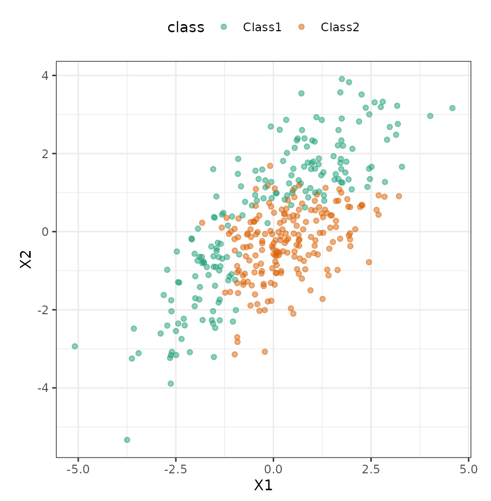
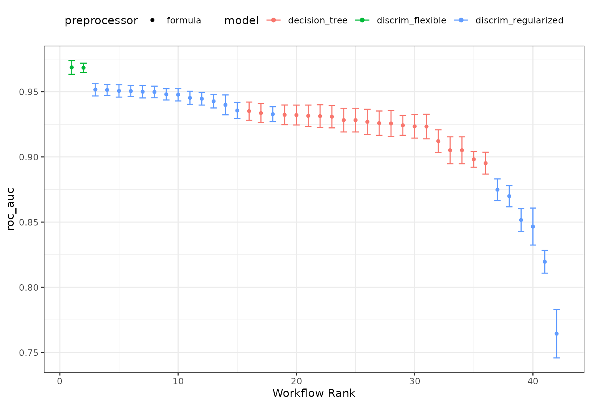
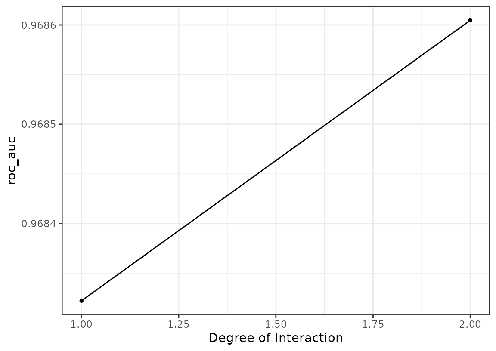
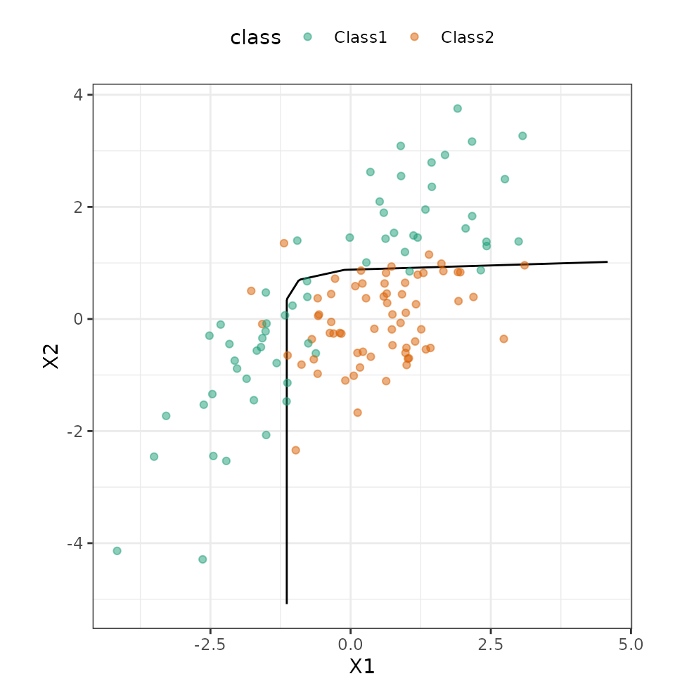

# Tuning and comparing models

Workflow sets are collections of tidymodels workflow objects that are
created as a set. A [workflow](https://workflows.tidymodels.org/) object
is a combination of a preprocessor (e.g. a formula or recipe) and a
parsnip model specification.

For some problems, users might want to try different combinations of
preprocessing options, models, and/or predictor sets. Instead of
creating a large number of individual objects, a cohort of workflows can
be created simultaneously.

In this example we’ll use a small, two-dimensional data set for
illustrating classification models. The data are in the
[modeldata](https://modeldata.tidymodels.org/) package:

``` r
library(tidymodels)

data(parabolic)
str(parabolic)
#> tibble [500 × 3] (S3: tbl_df/tbl/data.frame)
#>  $ X1   : num [1:500] 3.29 1.47 1.66 1.6 2.17 ...
#>  $ X2   : num [1:500] 1.661 0.414 0.791 0.276 3.166 ...
#>  $ class: Factor w/ 2 levels "Class1","Class2": 1 2 2 2 1 1 2 1 2 1 ...
```

Let’s hold back 25% of the data for a test set:

``` r
set.seed(1)
split <- initial_split(parabolic)

train_set <- training(split)
test_set <- testing(split)
```

Visually, we can see that the predictors are mildly correlated and some
type of nonlinear class boundary is probably needed.

``` r
ggplot(train_set, aes(x = X1, y = X2, col = class)) +
  geom_point(alpha = 0.5) +
  coord_fixed(ratio = 1) +
  scale_color_brewer(palette = "Dark2")
```



## Defining the models

We’ll fit two types of discriminant analysis (DA) models (regularized DA
and flexible DA using MARS, multivariate adaptive regression splines) as
well as a simple classification tree. Let’s create those parsnip model
objects:

``` r
library(discrim)

mars_disc_spec <-
  discrim_flexible(prod_degree = tune()) |>
  set_engine("earth")

reg_disc_sepc <-
  discrim_regularized(frac_common_cov = tune(), frac_identity = tune()) |>
  set_engine("klaR")

cart_spec <-
  decision_tree(cost_complexity = tune(), min_n = tune()) |>
  set_engine("rpart") |>
  set_mode("classification")
```

Next, we’ll need a resampling method. Let’s use the bootstrap:

``` r
set.seed(2)
train_resamples <- bootstraps(train_set)
```

We have a simple data set so a basic formula will suffice for our
preprocessing. (If we needed more complex feature engineering, we could
use a recipe as a preprocessor instead.)

The workflow set takes a named list of preprocessors and a named list of
parsnip model specifications, and can cross them to find all
combinations. For our case, it will just make a set of workflows for our
models:

``` r
all_workflows <-
  workflow_set(
    preproc = list("formula" = class ~ .),
    models = list(regularized = reg_disc_sepc, mars = mars_disc_spec, cart = cart_spec)
  )
all_workflows
#> # A workflow set/tibble: 3 × 4
#>   wflow_id            info             option    result    
#>   <chr>               <list>           <list>    <list>    
#> 1 formula_regularized <tibble [1 × 4]> <opts[0]> <list [0]>
#> 2 formula_mars        <tibble [1 × 4]> <opts[0]> <list [0]>
#> 3 formula_cart        <tibble [1 × 4]> <opts[0]> <list [0]>
```

## Adding options to the models

We can add any specific options that we think are important for tuning
or resampling using the
[`option_add()`](https://workflowsets.tidymodels.org/dev/reference/option_add.md)
function.

For illustration, let’s use the `extract` argument of the [control
function](https://tune.tidymodels.org/reference/control_grid.html) to
save the fitted workflow. We can then pick which workflow should use
this option with the `id` argument:

``` r
all_workflows <-
  all_workflows |>
  option_add(
    id = "formula_cart",
    control = control_grid(extract = function(x) x)
  )
all_workflows
#> # A workflow set/tibble: 3 × 4
#>   wflow_id            info             option    result    
#>   <chr>               <list>           <list>    <list>    
#> 1 formula_regularized <tibble [1 × 4]> <opts[0]> <list [0]>
#> 2 formula_mars        <tibble [1 × 4]> <opts[0]> <list [0]>
#> 3 formula_cart        <tibble [1 × 4]> <opts[1]> <list [0]>
```

Keep in mind that this will save the fitted workflow for each resample
and each tuning parameter combination that we evaluate.

## Tuning the models

Since these models all have tuning parameters, we can apply the
[`workflow_map()`](https://workflowsets.tidymodels.org/dev/reference/workflow_map.md)
function to execute grid search for each of these model-specific
arguments. The default function to apply across the workflows is
[`tune_grid()`](https://tune.tidymodels.org/reference/tune_grid.html)
but other `tune_*()` functions and
[`fit_resamples()`](https://tune.tidymodels.org/reference/fit_resamples.html)
can be used by passing the function name as the first argument.

Let’s use the same grid size for each model. For the MARS model, there
are only two possible tuning parameter values but
[`tune_grid()`](https://tune.tidymodels.org/reference/tune_grid.html) is
forgiving about our request of 20 parameter values.

The `verbose` option provides a concise listing for which workflow is
being processed:

``` r
all_workflows <-
  all_workflows |>
  # Specifying arguments here adds to any previously set with `option_add()`:
  workflow_map(resamples = train_resamples, grid = 20, verbose = TRUE)
#> i 1 of 3 tuning:     formula_regularized
#> ✔ 1 of 3 tuning:     formula_regularized (43.1s)
#> i 2 of 3 tuning:     formula_mars
#> ✔ 2 of 3 tuning:     formula_mars (4.3s)
#> i 3 of 3 tuning:     formula_cart
#> ✔ 3 of 3 tuning:     formula_cart (33.1s)
all_workflows
#> # A workflow set/tibble: 3 × 4
#>   wflow_id            info             option    result   
#>   <chr>               <list>           <list>    <list>   
#> 1 formula_regularized <tibble [1 × 4]> <opts[2]> <tune[+]>
#> 2 formula_mars        <tibble [1 × 4]> <opts[2]> <tune[+]>
#> 3 formula_cart        <tibble [1 × 4]> <opts[3]> <tune[+]>
```

The `result` column now has the results of each
[`tune_grid()`](https://tune.tidymodels.org/reference/tune_grid.html)
call.

From these results, we can get quick assessments of how well these
models classified the data:

``` r
rank_results(all_workflows, rank_metric = "roc_auc")
#> # A tibble: 126 × 9
#>    wflow_id     .config .metric   mean std_err     n preprocessor model
#>    <chr>        <chr>   <chr>    <dbl>   <dbl> <int> <chr>        <chr>
#>  1 formula_mars pre0_m… accura… 0.911  0.00407    25 formula      disc…
#>  2 formula_mars pre0_m… brier_… 0.0745 0.00410    25 formula      disc…
#>  3 formula_mars pre0_m… roc_auc 0.969  0.00319    25 formula      disc…
#>  4 formula_mars pre0_m… accura… 0.904  0.00388    25 formula      disc…
#>  5 formula_mars pre0_m… brier_… 0.0761 0.00306    25 formula      disc…
#>  6 formula_mars pre0_m… roc_auc 0.968  0.00213    25 formula      disc…
#>  7 formula_reg… pre0_m… accura… 0.862  0.00501    25 formula      disc…
#>  8 formula_reg… pre0_m… brier_… 0.125  0.00150    25 formula      disc…
#>  9 formula_reg… pre0_m… roc_auc 0.952  0.00249    25 formula      disc…
#> 10 formula_reg… pre0_m… accura… 0.887  0.00381    25 formula      disc…
#> # ℹ 116 more rows
#> # ℹ 1 more variable: rank <int>

# or a handy plot:
autoplot(all_workflows, metric = "roc_auc")
```



## Examining specific model results

It looks like the MARS model did well. We can plot its results and also
pull out the tuning object too:

``` r
autoplot(all_workflows, metric = "roc_auc", id = "formula_mars")
```



Not much of a difference in performance; it may be prudent to use the
additive model (via `prod_degree = 1`).

We can also pull out the results of
[`tune_grid()`](https://tune.tidymodels.org/reference/tune_grid.html)
for this model:

``` r
mars_results <-
  all_workflows |>
  extract_workflow_set_result("formula_mars")
mars_results
#> # Tuning results
#> # Bootstrap sampling 
#> # A tibble: 25 × 4
#>    splits            id          .metrics         .notes          
#>    <list>            <chr>       <list>           <list>          
#>  1 <split [375/134]> Bootstrap01 <tibble [6 × 5]> <tibble [0 × 4]>
#>  2 <split [375/132]> Bootstrap02 <tibble [6 × 5]> <tibble [0 × 4]>
#>  3 <split [375/142]> Bootstrap03 <tibble [6 × 5]> <tibble [0 × 4]>
#>  4 <split [375/146]> Bootstrap04 <tibble [6 × 5]> <tibble [0 × 4]>
#>  5 <split [375/135]> Bootstrap05 <tibble [6 × 5]> <tibble [0 × 4]>
#>  6 <split [375/131]> Bootstrap06 <tibble [6 × 5]> <tibble [0 × 4]>
#>  7 <split [375/139]> Bootstrap07 <tibble [6 × 5]> <tibble [0 × 4]>
#>  8 <split [375/136]> Bootstrap08 <tibble [6 × 5]> <tibble [0 × 4]>
#>  9 <split [375/137]> Bootstrap09 <tibble [6 × 5]> <tibble [0 × 4]>
#> 10 <split [375/139]> Bootstrap10 <tibble [6 × 5]> <tibble [0 × 4]>
#> # ℹ 15 more rows
```

Let’s get that workflow object and finalize the model:

``` r
mars_workflow <-
  all_workflows |>
  extract_workflow("formula_mars")
mars_workflow
#> ══ Workflow ═══════════════════════════════════════════════════════════
#> Preprocessor: Formula
#> Model: discrim_flexible()
#> 
#> ── Preprocessor ───────────────────────────────────────────────────────
#> class ~ .
#> 
#> ── Model ──────────────────────────────────────────────────────────────
#> Flexible Discriminant Model Specification (classification)
#> 
#> Main Arguments:
#>   prod_degree = tune()
#> 
#> Computational engine: earth

mars_workflow_fit <-
  mars_workflow |>
  finalize_workflow(tibble(prod_degree = 1)) |>
  fit(data = train_set)
mars_workflow_fit
#> ══ Workflow [trained] ═════════════════════════════════════════════════
#> Preprocessor: Formula
#> Model: discrim_flexible()
#> 
#> ── Preprocessor ───────────────────────────────────────────────────────
#> class ~ .
#> 
#> ── Model ──────────────────────────────────────────────────────────────
#> Call:
#> mda::fda(formula = ..y ~ ., data = data, method = earth::earth, 
#>     degree = ~1)
#> 
#> Dimension: 1 
#> 
#> Percent Between-Group Variance Explained:
#>  v1 
#> 100 
#> 
#> Training Misclassification Error: 0.08533 ( N = 375 )
```

Let’s see how well these data work on the test set:

``` r
# Make a grid to predict the whole space:
grid <-
  crossing(
    X1 = seq(min(train_set$X1), max(train_set$X1), length.out = 250),
    X2 = seq(min(train_set$X1), max(train_set$X2), length.out = 250)
  )

grid <-
  grid |>
  bind_cols(predict(mars_workflow_fit, grid, type = "prob"))
```

We can produce a contour plot for the class boundary, then overlay the
data:

``` r
ggplot(grid, aes(x = X1, y = X2)) +
  geom_contour(aes(z = .pred_Class2), breaks = 0.5, col = "black") +
  geom_point(data = test_set, aes(col = class), alpha = 0.5) +
  coord_fixed(ratio = 1) +
  scale_color_brewer(palette = "Dark2")
```



The workflow set allows us to screen many models to find one that does
very well. This can be combined with parallel processing and,
especially, racing methods from the
[finetune](https://finetune.tidymodels.org/reference/tune_race_anova.html)
package to optimize efficiency.

## Extracting information from the results

Recall that we added an option to the CART model to extract the model
results. Let’s pull out the CART tuning results and see what we have:

``` r
cart_res <-
  all_workflows |>
  extract_workflow_set_result("formula_cart")
cart_res
#> # Tuning results
#> # Bootstrap sampling 
#> # A tibble: 25 × 5
#>    splits            id          .metrics          .notes   .extracts
#>    <list>            <chr>       <list>            <list>   <list>   
#>  1 <split [375/134]> Bootstrap01 <tibble [60 × 6]> <tibble> <tibble> 
#>  2 <split [375/132]> Bootstrap02 <tibble [60 × 6]> <tibble> <tibble> 
#>  3 <split [375/142]> Bootstrap03 <tibble [60 × 6]> <tibble> <tibble> 
#>  4 <split [375/146]> Bootstrap04 <tibble [60 × 6]> <tibble> <tibble> 
#>  5 <split [375/135]> Bootstrap05 <tibble [60 × 6]> <tibble> <tibble> 
#>  6 <split [375/131]> Bootstrap06 <tibble [60 × 6]> <tibble> <tibble> 
#>  7 <split [375/139]> Bootstrap07 <tibble [60 × 6]> <tibble> <tibble> 
#>  8 <split [375/136]> Bootstrap08 <tibble [60 × 6]> <tibble> <tibble> 
#>  9 <split [375/137]> Bootstrap09 <tibble [60 × 6]> <tibble> <tibble> 
#> 10 <split [375/139]> Bootstrap10 <tibble [60 × 6]> <tibble> <tibble> 
#> # ℹ 15 more rows
```

The `.extracts` has 20 rows for each resample (since there were 20
tuning parameter candidates). Each tibble in that column has a fitted
workflow for each candidate and, since `cart_res` has 25 rows, a value
returned for each resample. That’s 500 fitted workflows.

Let’s slim that down by keeping the ones that correspond to the best
tuning parameters:

``` r
# Get the best results
best_cart <- select_best(cart_res, metric = "roc_auc")

cart_wflows <-
  cart_res |>
  select(id, .extracts) |>
  unnest(cols = .extracts) |>
  inner_join(best_cart)
#> Joining with `by = join_by(cost_complexity, min_n, .config)`

cart_wflows
#> # A tibble: 25 × 5
#>    id          cost_complexity min_n .extracts  .config         
#>    <chr>                 <dbl> <int> <list>     <chr>           
#>  1 Bootstrap01   0.00000000785    18 <workflow> pre0_mod05_post0
#>  2 Bootstrap02   0.00000000785    18 <workflow> pre0_mod05_post0
#>  3 Bootstrap03   0.00000000785    18 <workflow> pre0_mod05_post0
#>  4 Bootstrap04   0.00000000785    18 <workflow> pre0_mod05_post0
#>  5 Bootstrap05   0.00000000785    18 <workflow> pre0_mod05_post0
#>  6 Bootstrap06   0.00000000785    18 <workflow> pre0_mod05_post0
#>  7 Bootstrap07   0.00000000785    18 <workflow> pre0_mod05_post0
#>  8 Bootstrap08   0.00000000785    18 <workflow> pre0_mod05_post0
#>  9 Bootstrap09   0.00000000785    18 <workflow> pre0_mod05_post0
#> 10 Bootstrap10   0.00000000785    18 <workflow> pre0_mod05_post0
#> # ℹ 15 more rows
```

What can we do with these? Let’s write a function to return the number
of terminal nodes in the tree.

``` r
num_nodes <- function(wflow) {
  var_imps <-
    wflow |>
    # Pull out the rpart model
    extract_fit_engine() |>
    # The 'frame' element is a matrix with a column that
    # indicates which leaves are terminal
    pluck("frame") |>
    # Convert to a data frame
    as_tibble() |>
    # Save only the rows that are terminal nodes
    filter(var == "<leaf>") |>
    # Count them
    nrow()
}

cart_wflows$.extracts[[1]] |> num_nodes()
```

Now let’s create a column with the results for each resample:

``` r
cart_wflows <-
  cart_wflows |>
  mutate(num_nodes = map_int(.extracts, num_nodes))
cart_wflows
#> # A tibble: 25 × 6
#>    id          cost_complexity min_n .extracts  .config       num_nodes
#>    <chr>                 <dbl> <int> <list>     <chr>             <int>
#>  1 Bootstrap01   0.00000000785    18 <workflow> pre0_mod05_p…         9
#>  2 Bootstrap02   0.00000000785    18 <workflow> pre0_mod05_p…         9
#>  3 Bootstrap03   0.00000000785    18 <workflow> pre0_mod05_p…         7
#>  4 Bootstrap04   0.00000000785    18 <workflow> pre0_mod05_p…         7
#>  5 Bootstrap05   0.00000000785    18 <workflow> pre0_mod05_p…        10
#>  6 Bootstrap06   0.00000000785    18 <workflow> pre0_mod05_p…         6
#>  7 Bootstrap07   0.00000000785    18 <workflow> pre0_mod05_p…         7
#>  8 Bootstrap08   0.00000000785    18 <workflow> pre0_mod05_p…         3
#>  9 Bootstrap09   0.00000000785    18 <workflow> pre0_mod05_p…         8
#> 10 Bootstrap10   0.00000000785    18 <workflow> pre0_mod05_p…         5
#> # ℹ 15 more rows
```

The average number of terminal nodes for this model is 7.3 nodes.
